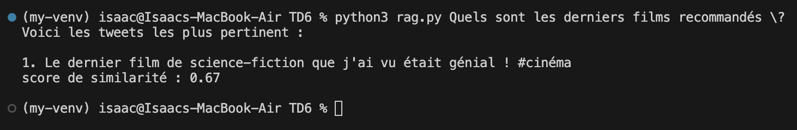
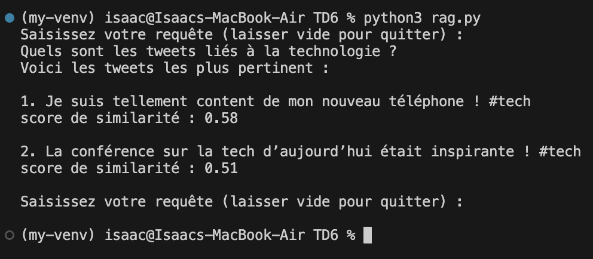

# Compte-rendu du mini-projet NLP

Nom : GHORZI \
Prénom : Isaac \
Num. Etudiant : 22400381

## Sommaire

* [Objectif du projet](#objectif)
* [Cahier des charges](#cahier-des-charges)
* [Ressources utilisées](#ressources)
* [Développement du programme](#développement-du-projet)
* [Définition des fonctions](#définition-des-fonctions)

## Objectif

L'objectif de ce projet était de concevoir un programme de traitement du langage naturel (NLP) en implémentant un système de RAG (Retrieval-Augmented Generation) dans le but d'encoder des documents et des requêtes sous forme d'embeddings.

Un embedding est la représentation d'une donnée sous forme vectorielle, permettant d'effectuer des opérations mathématiques dessus comme la distance cosinus pour déterminer la similarité entre deux phrases.

Le programme devait convertir des documents, puis une requête saisie par utilisateur en embeddings afin de déterminer quels documents sont les plus pertinents par rapport à la requête.
Autrement dit, un utilisateur devait pouvoir chercher un document en saisissant une requête sur le programme.

## Cahier des charges

* Le programme devait disposer d'une interface utilisateur en lignes de commande pour saisir les requêtes.
* Les documents devaient être enregistrés dans un fichier Json avec leur index et vecteur d'embeddings.
* Le programme devait renvoyer seulement les documents pertinents à la requête.

## Ressources

Le programme a été écrit en python.
Pour implémenter ce système, on a utilisé les modules suivants :

1. Modules standarts :
    * json : Pour stocker des données sous forme de fichiers Json;
    * sys : Pour interprêter des éventuelles requêtes entrées en lignes de commande;

2. Modules externes :
    * numpy : Pour réaliser des calculs vectoriels;
    * sentence_transformers : Un module permettant d'encoder une chaîne de caractère en un vecteur d'embeddings à l'aide d'un modèle d'encodage;

## Développement du projet

### Installation du module Sentence Transformers

Pour pouvoir commencer à écrire le programme, il était nécessaire d'installer le module "Sentence Transformers" afin de pouvoir encoder les documents et les requêtes. Ce module nécessitait dans un premier temps d'installer une version antérieure de python, ici la version 3.11 :

```zsh
brew install python@3.11
```

Et dans un second temps, la création d'un environnement virtuel pour python :

```zsh
python3.11 venv .venv
source .venv/bin/activate
```

Ici, la première ligne créer un dossier ".venv" contenant l'environnement virtuel python version 3.11.
La seconde ligne permet d'activer l'environnement virtuel. Comme les environnement virtuels sont isolés de l'environnement global et entre eux, c'est une étape obligatoire pour avoir installer et accès aux modules installés sur cet environnement virtuel.

Enfin, on installe tout simplement le module :

```zsh
python3 -m pip install sentence_transformers
```

### Pipeline d'encodage des documents

Une fois que les modules nécessaires ont été installés et importés dans le programme python, il fallait écrire un algorithme qui devait encoder et stocker les documents dans un fichier Json.

Pour y parvenir, il nous fallait un modèle de traitement du langage naturel. Ici, on a utilisé "paraphrase-MiniLM-L6-v2", qui est un modèle basé sur la technique d'encodage BERT inclus dans le module Sentence Transformers.

Il y a plusieurs grandes étapes dans cette pipeline :

1. Récupération des données;
2. Encodage des documents et mise en mémoire des embeddings;
3. Enregistrement des documents et de leurs embeddings;

#### Récupération des données

Tout d'abord, le programme récupère les données du fichier source, ici `tweets.txt`. Il va ensuite transformer ces données en une liste de chaînes de caractères, chaque élément étant un tweet.

#### Encodage des documents

Puis on instantie un objet de la classe Sentence Transformer basé sur le modèle "paraphrase-MiniLM-L6-v2".
Une boucle va itérer sur chaque éléments de la liste de tweets et va tous les encoder en vecteur d'embeddings via une méthode de l'objet. On gardera ces vecteur dans une liste séparé pour les sauvegarder plus tard.

#### Enregistrement

Une fois tout les documents encodés, on procède à leur enregistrement dans un fichier json.
Une nouvelle boucle va alors itérer sur 2 listes : celle des tweets et celle des vecteurs. On va ensuite mettre dans un dictionnaire les données suivantes :

* `id` : l'index du tweet;
* `texte` : le contenu du tweet;
* `vecteur` : le vecteur d'embeddings;

Le dictionnaire sera ensuite ajouté à une liste, qui sera convertie en liste Json à l'aide du module `json` une fois que la boucle sera entièrement terminée. Le fichier Json dans lequel on enregistrera ces données est nommé `embeddings-tweets.json`.

### Pipeline d'encodage des requêtes

Voici les étapes de la pipeline :

1. Récupération des requêtes saisies par l'utilisateur;
2. Encodage des requêtes;
3. Affichage des documents pertinents;

#### Lecture des requêtes utilisateur

On a implémenté 2 façons de saisir une requête :

* Saisie lors de l'appel du programme en ligne de commande sous forme d'arguments;
* Saisie pendant le fonctionnement du programme;

Si l'utilisateur lance le programme en ligne de commande comme ceci :

```zsh
rag.py ce film était génial
```

Alors le programme va récupérer la requête "ce film était génial" et va effectuer la recherche puis s'arrêter après avoir affiché les résultats.


*Exemple de saisie de requête sous forme d'arguments*

Sinon, lorsque le programme est lancé normalement, l'utilisateur a la possibilité de saisir sa requête. Si l'utilsateur valide sans rien saisir, alors le programme prend fin. Cependant, si l'utilisateur valide et qu'il a bien écrit une requête, alors celle-ci sera traitée. Le programme continuera à lire les requêtes utilisateurs jusqu'a ce que celui-ci envoie une requête vide.


*Exemple de saisie d'une seule requête*


*Exemple de saisie de deux requêtes*

#### Encodage de la requête

Dans le cas où la saisie est traitée, celle-ci sera encodé en vecteur d'embedding par le même modèle qui a encodé les tweets dans un premier temps, avant d'être comparé aux vecteurs des documents dans une boucle dans un second temps.

#### Affichage des tweets pertinents

Pour déterminer la similarité des tweets avec la requête, on a calculé la distance cosinus entre les vecteurs, puis on a stocké les résultats dans une liste qui contiendra également l'index du document correspondant. Le résultat du calcul servira de score de similarité. Cette liste sera ensuite triée et on affichera seulement les tweets ayant eu un score de similarité supérieur à 0.40.

On affiche alors, pour un tweet, son contenu et son score de similarité avec la requête en dessous.

## Définition des fonctions

```python
def read_tweets():
    try:
        f = open("tweets.txt", 'r')
    except:
        raise Exception("Le fichier des tweets n'existe pas : \"tweets.txt\"\n")
    else:
        data = f.readlines()
        f.close()
    return data
```

Cette fonction essaie de charger le fichier "tweets.txt" en mémoire. Si le fichier n'existe pas alors il renvoie une erreur. Sinon il récupère toutes les lignes du fichier et les affecte à une liste qui va être renvoyée à la fin de la fonction.

```python
def gen_embeds(model: st):
    data = read_tweets()
    embeddings = model.encode(data)

    doclist = []
    index = 1
    for document in data:
        doclist.append(
            {
                "id": index,
                "texte": document,
                "vecteur": embeddings[index-1].tolist()
            }
        )
        index += 1

    destination = open("embeddings-tweets.json", 'w')
    js.dump(doclist, destination, indent=4, ensure_ascii=False)
    destination.close()
```

Cette fonction prend une instance de Sentence Transformer (st) en paramètre. Elle va récupérer les données à encoder via la fonction `read_tweets()`. L'encodage est ensuite pris en charge par la méthode `encode()` du modèle. La fonction place les vecteur dans une dictionnaire avec le contenu du document et son indexe, et ce même dictionnaire sera ajouté à une liste qui sera convertie en liste Json et sauvegardé dans un fichier du même format.

```python
def parse_input(args: list) -> str:
    return ' '.join(args).strip()
```

Cette fonction va prendre une liste de chaînes de caractères et les unir ensemble en supprimant quelconque espace en trop.

```python
def simil_cos(a, b):
    return np.dot(a, b) / (np.linalg.norm(a) * np.linalg.norm(b))
```

Cette fonction renvoie la distance cosinus entre deux vecteurs a et b.

```python
def init(model: st, quiet = True):
    try:
        f = open("embeddings-tweets.json", 'r')
    except:
        if quiet == False : print("Génération des embeddings en cours..\n")
        gen_embeds(model)
        f = open("embeddings-tweets.json", 'r')
    finally:
        f.close()
    if quiet == False : print("Initialisation terminée !\n")
```

Cette fonction va vérifier que les données existent pour déterminer s'il est nécessaire de générer un nouveau fichier Json contenant les embeddings.

```python
def start(model: st, quiet = True):
    if quiet == False : print("Lancement du programme")
    init(model)
    args = sys.argv[1:]
    cli = False
    msg = "Saisissez votre requête (laisser vide pour quitter) :\n"

    if len(args) > 0:
        req = parse_input(args)
        cli = True
    else:
        req = input(msg)

    if req.strip() == "":
        return

    while True:
        resultat = list()
        with open("embeddings-tweets.json", 'r') as jsf:
            jsdata = js.load(jsf)
            for tweet in jsdata:
                resultat.append((simil_cos(np.array(model.encode(req)), tweet["vecteur"]), tweet["texte"].strip()))

        resultat = sorted(resultat, reverse=True)
        print("Voici les tweets les plus pertinent :\n")
        position = 1
        for tweet in resultat:
            if tweet[0] >= 0.5 : print(f"{position}. {tweet[1]}\nscore de similarité : {float('%.2f'%tweet[0])}\n")
            position += 1

        if cli : break
        req = input(msg)
        if req.strip() == "":
            break

    if quiet == False : print("Fin du programme")
```

C'est la fonction principale du programme. C'est ici que le programme va récupérer les requêtes et procéder à la recherche de correspondance avec les documents et à leur classement pour les afficher. Pour s'assurer que le programme continue toujours de demander à l'utilisateur de saisir sa requête, tout se passe dans une boucle infinie qui ne s'arrête seulement quand l'utilisateur ne saisit rien et valide. La boucle ne s'exécute qu'une seule fois lorsque l'utilisateur entre sa requête en tant qu'arguments du programme.
